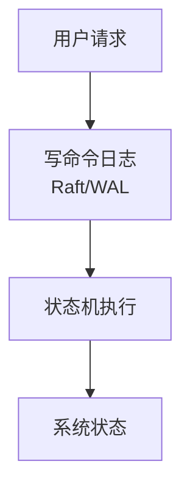
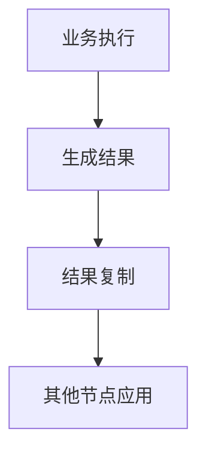

<!-- AUTO-GENERATED by tools/split-notes.ps1 — 请勿手工编辑；内容变更请修改源笔记后重跑脚本。 -->
<!-- Source: trading-system-notes-Chinese.md 《交易系统开发》张智炫 https://github.com/zzxscodes/trading-system-notes -->
<!-- Section: 业务逻辑设计-系统 / 14. 分布式交易系统共识模型 -->

# 分布式交易系统共识模型

> 来源章节：**业务逻辑设计-系统 › 14. 分布式交易系统共识模型**
> 本文为原始笔记的逐字副本，作为 skill 的按需参考资料（progressive disclosure）。

**一、两种共识模型定义**

**1. 命令共识 (Replicated State Machine)**

**核心逻辑**：先对操作命令达成共识，再在所有节点执行相同逻辑。



**日志内容**：`PlaceNewOrder`, `CancelOrder`, `AmendOrder`


**2. 结果共识**

**核心逻辑**：主节点先执行，再对最终状态结果达成共识并同步。



**日志内容**：`TradeResult`, `BalanceUpdate`, `PositionUpdate`


**二、撮合引擎：命令共识**

1. **确定性**：确定输入 -> 确定输出（价格优先、时间优先、FIFO）
2. **状态小**：仅 OrderBook + OrderStatus，恢复快
3. **可审计**：完整订单流可重放

**伪代码示例**

```cpp
// 1. 共识日志结构
struct CommandLog {
    enum Type { PLACE, CANCEL, AMEND };
    Type type;
    Order order;
    uint64_t sequence; // 严格递增序号
};

// 2. 撮合状态机执行 (所有节点执行此相同逻辑)
void applyCommand(const CommandLog& cmd, OrderBook& book) {
    switch(cmd.type) {
        case PLACE:
            book.add(cmd.order);
            match(book); // 确定性撮合逻辑
            break;
        case CANCEL:
            book.remove(cmd.order.id);
            break;
        // ...
    }
}

// 3. 故障恢复：重放日志即可
void recover(OrderBook& book, const std::vector<CommandLog>& logs) {
    for (const auto& log : logs) {
        applyCommand(log, book); // 结果100%一致
    }
}
```


**三、柜台系统：结果共识**

1. **非确定性**：依赖外部因子（风控、市价、时间、配置...）
2. **状态大**：Account, Position, Margin, Ledger... (GB/TB级)
3. **防副作用**：避免重复扣费、重复通知

**伪代码示例**

```cpp
// 1. 柜台不适合命令重放的原因演示
// 同一个命令，不同时间执行结果可能不同
void processTrade(const Trade& trade) {
    // 依赖外部实时数据
    auto index_price = MarketData::getIndexPrice(trade.symbol);
    auto fee_rate = Config::getFeeRate(user_id); // 配置可能已变

    // 计算结果非确定
    auto margin = calcMargin(trade, index_price);
    auto fee = trade.volume * fee_rate;

    // 副作用：如果重放，会重复转账！
    Ledger::transfer(fee, Account::FEE_POOL);
}

// 2. 结果共识：直接同步最终状态
struct StateUpdate {
    AccountDelta account;   // {user_id, -100}
    PositionDelta position; // {user_id, BTC, +1}
    FeeDelta fee;           // {user_id, 5}
};

// 从节点只需应用结果，无需重算复杂逻辑
void applyStateUpdate(const StateUpdate& update) {
    Account::apply(update.account);   // 简单加减
    Position::apply(update.position);
    Fee::apply(update.fee);
    // 无副作用，幂等操作
}
```


**四、对比**

| 维度 | 撮合引擎 (命令共识) | 柜台系统 (结果共识) |
| :--- | :--- | :--- |
| **核心目标** | 市场演化一致性 | 账户资金正确性 |
| **确定性** | 闭合系统，确定输入→确定输出 | 依赖外部，结果随时间/配置变 |
| **状态体量** | 小 (几十MB) | 大 (GB/TB) |
| **恢复方式** | 重放命令 | 同步状态快照 |
| **副作用** | 无 | 有 (记账、通知) |
| **性能焦点** | 低延迟 | 高吞吐、可靠性 |


**架构协同**：
`Client -> [撮合 (命令共识)] -> TradeEvent -> [柜台 (结果共识)] -> AccountState`


